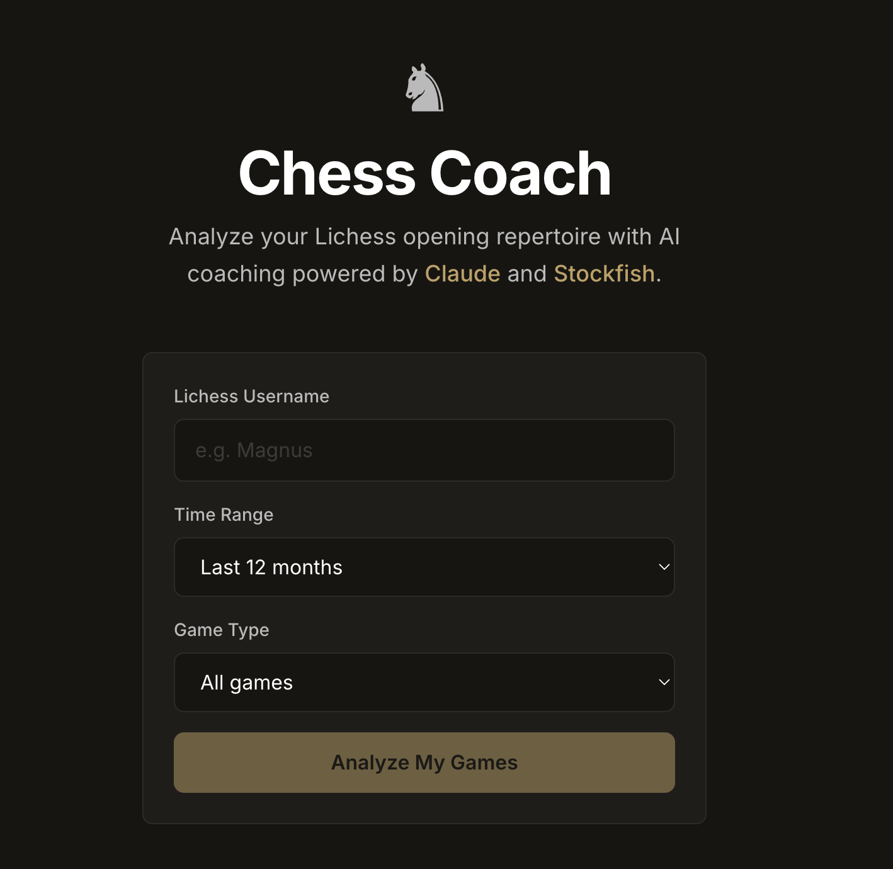

# Chess Coach

**AI-powered opening repertoire analysis for Lichess players — powered by Claude and Stockfish.**

> Live at [projects.akshitkalra.com/aichesscoach](https://projects.akshitkalra.com/aichesscoach)



---

## Example

**Input:** Lichess username `noob042`, Rapid games, last 12 months

**Opening surfaced:** Caro-Kann Defense (19 games as White)

**Diagnosis:** Frequent tactical losses after early queenside expansion. Weak handling of central tension in positions where Black delays ...c5.

**Coaching recommendation:** Delay queenside pawn advances until development is complete. Study 3 model Caro-Kann games focused on ...c5 timing. Review tactical motifs after White overextends in the center.

---

## The Problem

Chess engines like Stockfish will tell you move 17 was a blunder. They won't tell you *why* you keep blundering in the same opening, what positional themes you're missing, or what to study next.

Serious improvers with hundreds of games on Lichess have no easy way to get **opening-level coaching** — the kind of feedback that says "you consistently mishandle the pawn break in the Caro-Kann" rather than "Nf3 was -1.2."

Chess Coach bridges that gap: enter your Lichess username, and it analyzes your entire opening repertoire with engine precision and natural language coaching.

---

## The Solution

1. **Fetch** your rated games from the Lichess API
2. **Group** them by opening (ECO code + name)
3. **Analyze** each game with Stockfish — centipawn loss per move, key tactical moments
4. **Diagnose** patterns across games — are you losing to tactics, theory gaps, positional misunderstanding, or endgame technique?
5. **Coach** with Claude — one concrete, actionable recommendation per opening: what to study, what to practice, what to stop doing

The result is a repertoire overview with win rates, accuracy scores, and AI coaching for each opening you play.

---

## Technical Decisions & Tradeoffs

**Why Claude over GPT?**
Claude produces more nuanced, less generic coaching. GPT tends toward safe platitudes ("consider developing your pieces"). Claude gives specific, evidence-based advice tied to the actual positions from your games. The 2-phase prompting strategy (opening knowledge first, then coaching with diagnosis) produces significantly better output than a single prompt.

**Why Stockfish + Claude instead of just Claude?**
LLMs hallucinate chess analysis. Stockfish gives ground-truth engine evaluation (centipawn loss, tactical swings). Claude's job is to interpret those numbers and explain them in human terms. Separation of concerns: the engine handles precision, the LLM handles explanation.

**Why Supabase for caching?**
Stockfish analysis is expensive (several seconds per game at depth 15). Caching ACPL results means repeat analyses for the same games are instant. Claude coaching is cached for 24 hours. Without this, the app would be 10x slower and 10x more expensive to run.

**What I cut:**
- No user accounts — just enter a username and go. Zero friction.
- No real-time game analysis — repertoire-level insights are more valuable than move-by-move commentary (Lichess already does that).
- No user accounts or payment — zero friction. Enter a username and go.

---

## Architecture

```
┌─────────────┐     HTTPS      ┌──────────────────┐
│   Browser    │ ◄────────────► │  Railway (Docker) │
│  React/Vite  │   REST + SSE   │  FastAPI/Uvicorn  │
│  Tailwind    │                │  Python 3.11      │
└─────────────┘                └────────┬─────────┘
   Vercel                               │
                          ┌─────────────┼─────────────┐
                          │             │             │
                   ┌──────▼──────┐ ┌────▼─────┐ ┌────▼──────┐
                   │ Lichess API │ │Stockfish │ │ Claude API│
                   │  (games)    │ │(engine)  │ │(coaching) │
                   └─────────────┘ └──────────┘ └───────────┘
                                        │
                                ┌───────▼───────┐
                                │   Supabase    │
                                │  (Postgres)   │
                                │  game cache   │
                                │  ACPL cache   │
                                │  coaching TTL │
                                └───────────────┘
```

**Request flow:**
1. `POST /overview` — fetches games from Lichess, groups by opening, returns stats with cached ACPL
2. `POST /analyse-opening` (SSE) — runs Stockfish on uncached games, streams progress, calls Claude for coaching

---

## What I Learned

**Deploying Python + a C++ binary is harder than deploying Python.** Stockfish isn't a pip package — it's a system binary. Getting it onto Railway required a Dockerfile with `apt-get install stockfish`, and the binary installs to `/usr/games/` on Debian, not `/usr/bin/`. Burned 2 hours on this.

**CORS errors are never what they seem.** The original bug wasn't a missing origin — it was `allow_credentials=True` combined with `allow_origins=["*"]`, which the CORS spec explicitly forbids. The browser error message just says "CORS error" with no hint about why.

**LLM prompting is engineering, not magic.** The 2-phase approach (opening knowledge → coaching with diagnosis) produces dramatically better output than a single "analyze this opening" prompt. Giving Claude the Stockfish diagnosis as structured input prevents hallucinated analysis.

**Cache everything that's deterministic.** Stockfish evaluation of the same game at the same depth will always produce the same result. Caching it in Supabase cut repeat analysis time from minutes to milliseconds.

---

## Known Limitations

- Only public Lichess accounts are supported (Lichess API limitation)
- Coaching quality depends on opening sample size — openings with fewer than 3 games are filtered out
- Repertoire-level feedback is more useful than one-off game review, but it can miss highly specific tactical lessons from individual games
- Claude explains engine output well, but strong recommendations still depend on accurate Stockfish diagnosis
- Benchmark and pricing data can drift as providers update models

---

## Tech Stack

| Layer | Technology |
|-------|-----------|
| Frontend | React 18 + Vite + Tailwind CSS |
| Backend | Python 3.11 + FastAPI |
| Chess Engine | Stockfish (depth 15) via python-chess |
| AI Coaching | Claude API (claude-sonnet-4-20250514) |
| Database | Supabase (Postgres + REST) |
| Game Data | Lichess Public API |
| Hosting | Vercel (frontend) + Railway (backend, Docker) |

---

## Setup

### Prerequisites

- Python 3.11+
- Node.js 18+
- Stockfish installed (`brew install stockfish` / `apt install stockfish`)
- An [Anthropic API key](https://console.anthropic.com)

### Backend

```bash
cd backend
python -m venv venv
source venv/bin/activate
pip install -r requirements.txt

cp ../.env.example .env
# Add your ANTHROPIC_API_KEY to .env

uvicorn main:app --reload --port 8000
```

### Frontend

```bash
cd frontend
npm install
npm run dev
```

Open `http://localhost:5173`.

---

## Environment Variables

| Variable | Required | Description |
|----------|----------|-------------|
| `ANTHROPIC_API_KEY` | Yes | From [console.anthropic.com](https://console.anthropic.com) |
| `SUPABASE_URL` | No | Defaults to project instance |
| `SUPABASE_KEY` | No | Defaults to project anon key |

---

## Usage Notes

- Only public Lichess accounts are supported (API limitation)
- Lichess rate limit: 1 req/sec for game exports (respected automatically)
- First analysis takes 1-3 minutes depending on game count; repeat analyses are cached
- Stockfish analysis is cached indefinitely; Claude coaching is cached for 24 hours

---

Built by [Akshit Kalra](https://www.akshitkalra.com/)

[](https://docs.anthropic.com)
